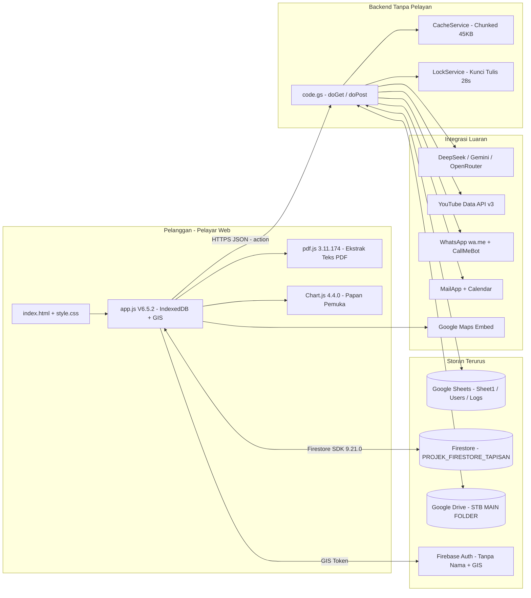
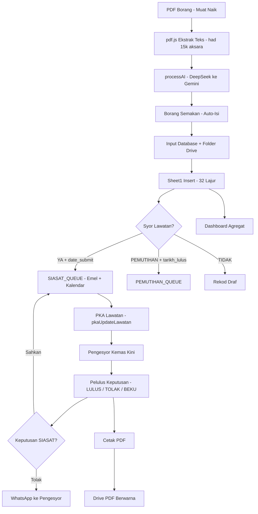
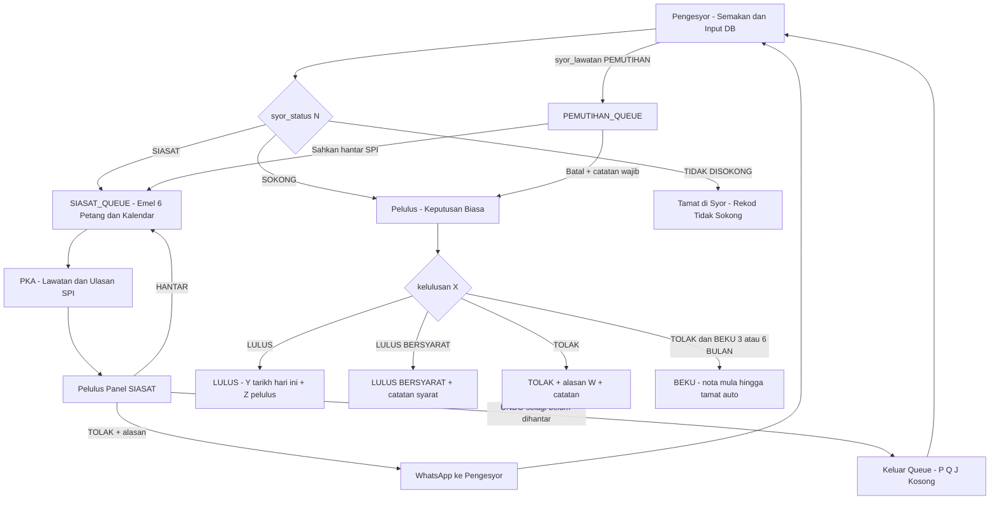

# Sistem Bersepadu V1 SPTB-PKK — Dokumen Senibina & Struktur Sistem (`structure.md`)

> **Kawalan Dokumen**
>
> | Perkara | Butiran |
> |---|---|
> | Nama Sistem | Sistem Bersepadu V1 SPTB-PKK (dikenali sebagai Sistem Bersepadu SPTB (HQ) V6.5.2) |
> | Pemilik Sistem | Ibu Pejabat (HQ) — Pusat Khidmat Kontraktor (PKK), Kementerian Pembangunan Usahawan dan Koperasi (KUSKOP) |
> | Repositori Rujukan | `https://github.com/SPTB-PKK-HQ/Integrated-System-V1` |
> | Versi Sistem | V6.5.2 Web App / Enjin Data v610 / Binaan `20260926-siasat-tolak-fix` |
> | Versi Dokumen | 1.0 |
> | Tarikh Dokumen | 26 September 2026 |
> | Bahasa | Bahasa Melayu Teknikal (Sektor Awam) |
> | Skop | Aplikasi Web sedia ada sahaja (`index.html`, `app.js`, `code.gs`). Modul Android masa depan adalah luar skop. |
> | Klasifikasi | Terhad — Untuk kegunaan rasmi sahaja |

---

## 1. Pengenalan & Profil Sistem

### 1.1 Nama, Pemilik dan Mandat

Sistem Bersepadu V1 SPTB-PKK ialah sistem pengurusan permohonan kontraktor di bawah seliaan Ibu Pejabat (HQ). Sistem ini menyokong fungsi Pusat Khidmat Kontraktor (PKK) di bawah KUSKOP bagi menguruskan kitaran hayat permohonan Sijil Kontraktor dari peringkat semakan hingga kelulusan.

Pemilik sistem ialah **HQ (SPTB-PKK-HQ)**. Pentadbiran teknikal dilaksanakan melalui akaun perkhidmatan Google Workspace kerajaan dengan domain dibenarkan `@kuskop.gov.my`.

### 1.2 Objektif Utama dalam Skop Perkhidmatan Awam

1. **Pemusatan Permohonan:** Menguruskan empat jenis permohonan — `BARU`, `PEMBAHARUAN`, `UBAH MAKLUMAT`, `UBAH GRED` — dalam satu pangkalan data berpusat (Google Sheets + Firestore).
2. **Aliran Kerja Syor dan Kelulusan:** Melaksanakan aliran `PENGESYOR > PELULUS` dengan pengesahan kendiri (checkbox sah), penetapan Pelulus melalui WhatsApp, dan keputusan `LULUS / LULUS BERSYARAT / TOLAK / TOLAK & BEKU 3 BULAN / TOLAK & BEKU 6 BULAN`.
3. **Siasatan dan Lawatan (SPI/PKA):** Menguruskan syor lawatan `YA / TIDAK / PEMUTIHAN / SIASAT`, penghantaran ke SPI melalui barisan gilir (queue) berjadual, kemas kini lawatan oleh peranan PKA, dan penjanaan acara kalendar SPI.
4. **Ketepatan Data:** Menyediakan auto-ekstrak PDF borang menggunakan Kecerdasan Buatan (AI) dengan pembetulan peraturan syarikat dan alamat, semakan dokumen (Carta/Peta/Gambar/Sewa), KWSP 3 bulan, dan pengesahan bank.
5. **Kebolehkesanan dan Pelaporan:** Menyediakan papan pemuka (dashboard) analisis, senarai permohonan dengan tapisan, sejarah keputusan, log audit (`Logs`), pengurusan dokumen Google Drive berstruktur, penjadualan WhatsApp, dan carian video rujukan (YouTube).
6. **Pematuhan Keselamatan ICT Sektor Awam:** Menguatkuasakan kawalan akses berasaskan peranan, pengesahan domain, pengasingan kunci API dalam Script Properties, dan jejak audit bagi setiap operasi tulis.

### 1.3 Peranan Pengguna

| Peranan | Singkatan | Fungsi Utama |
|---|---|---|
| Pengesyor | `PENGESYOR` | Menyemak borang, menghantar syor (`SOKONG / SIASAT / TIDAK DISOKONG`), mengurus bakul dan tapisan Excel |
| Pelulus | `PELULUS` | Membuat keputusan muktamad, mengesahkan atau menolak kes SIASAT ke SPI |
| Pengarah | `PENGARAH` | Pemantauan dan kelulusan peringkat pengurusan |
| Ketua Seksyen | `KETUA_SEKSYEN` | Pemantauan seksyen (normalisasi ejaan dikendalikan di backend) |
| Pentadbir | `ADMIN` | Pengurusan pengguna, pengarkiban tahunan, pembersihan kod Firebase, capaian penuh |
| Pembantu Khidmat Pelanggan / SPI | `PKA` | Mengemaskini lawatan (`lawatan_tarikh`, `lawatan_submit_sptb`, `lawatan_syor`, `ulasan_spi`), menghubungi Pengesyor |

### 1.4 Status Sistem Sedia Ada

Sistem sedia ada ialah **aplikasi web statik** yang dihoskan sebagai tapak statik (serasi GitHub Pages / mana-mana hos HTTPS) dengan backend tanpa pelayan (serverless) menggunakan Google Apps Script. Tiada pelayan aplikasi khusus yang perlu disenggara. Versi aplikasi web semasa ialah **V6.5.2**.

---

## 2. Senibina Perisian (Architecture)

### 2.1 Corak Senibina: Monolit Klien + Backend Tanpa Pelayan (Serverless BaaS)

Berdasarkan analisis kod sumber (`app.js` 17,888 baris / `code.gs` 5,108 baris), sistem ini **tidak** menggunakan MVC tradisional, Microservices, atau monolit pelayan Java/PHP. Corak yang digunakan ialah:

> **Monolit Bahagian Hadapan (Frontend Monolith) + Pintu Gerbang API Tunggal Tanpa Pelayan + Pangkalan Data Terurus (BaaS).**

Penjelasan:

* **Tiada lapisan `controllers/`, `models/`, `routes/`, `config/` fizikal.** Fungsi tersebut wujud secara logik tetapi diimplementasikan dalam dua fail utama:
  * Pengawal dan penghala logik = fungsi `doGet(e)` dan `doPost(e)` dalam `code.gs` yang membezakan tindakan melalui parameter `action`.
  * Model data = hamparan Google Sheets (`Sheet1`, `Users`, `Logs`) serta koleksi Firestore untuk tapisan dan bakul.
  * Paparan = `index.html` + `style.css` + DOM yang dimanipulasi oleh `app.js`.
* **Sebab pemilihan:** Meminimumkan kos infrastruktur, memanfaatkan perkhidmatan Google Workspace kerajaan yang sedia ada, membolehkan capaian tanpa nama (anonymous) di peringkat Web App dengan kawalan akses di peringkat aplikasi, dan menyokong pembangunan pantas tanpa pengurusan pelayan.
* **Bukan Microservices:** Semua logik backend berada dalam satu projek Apps Script dengan kunci konkurensi tunggal (`LockService.getScriptLock()`) bagi operasi tulis. Penskaleran adalah menegak melalui cache, bukan melalui perkhidmatan teragih.

### 2.2 Rajah Senibina Logik



### 2.3 Prinsip Reka Bentuk Utama

1. **Pintu Tunggal RPC:** Satu URL `/exec` mengendalikan semua tindakan. Penghalaan adalah berasaskan nilai `action`, bukan laluan URL. Ini memudahkan kawalan keselamatan berpusat.
2. **Pertahanan Berlapis:** CSP ketat di `index.html`, pengesahan domain, semakan peranan di setiap handler kritikal, dan pengasingan kunci API dalam Script Properties (bukan dalam kod).
3. **Ketahanan Bacaan:** Mekanisme `fetchWithRetry` (baca: 2 cubaan, lengah 3s, backoff), cache chunked gzip+base64 45KB setiap chunk, kunci bina semula (rebuild lock) 90 saat bagi mengelakkan rempuhan (stampede), dan tetingkap bulan semasa 3 bulan.
4. **Konsistensi Tulisan:** Semua tulis ke Sheets dikunci (28 saat). Tulis tidak diduplikasi semasa cubaan semula (tulis kekal 1 cubaan).
5. **Luar Talian Separa:** Cache sisi klien menggunakan IndexedDB (`SPTB_Storage`) untuk kunci besar dan `localStorage` untuk sesi, dengan pembersihan automatik apabila kuota penuh.

### 2.4 Pemetaan Konsep MVC kepada Sistem Sebenar

| Konsep Standard (Diminta dalam Arahan) | Pelaksanaan Sebenar dalam Repositori | Fail Rujukan |
|---|---|---|
| Controllers | Fungsi handler dalam `code.gs` (`handleInsertNewRecord`, `handleUpdateRecord`, `handleDeleteRecord`, `handleProcessAI`, dll.) | `code.gs` |
| Models | Skema lajur A–AF (32 lajur) dalam `Sheet1`, skema `Users`, skema `Logs`, dokumen Firestore | `code.gs: TOTAL_COLUMNS`, `SHEET_NAME` |
| Routes | Cabang `if (action === ...)` dalam `doGet`/`doPost` | `code.gs:397`, `code.gs:498` |
| Config | `appsscript.json` (zon masa, skop OAuth, runtime V8), `firebaseConfig` (di placeholder), Script Properties | `appsscript.json` |
| Views | `index.html` (11 tab) + `style.css` + templat PDF dalam `handleCetakDanSimpanPDF` | `index.html`, `style.css` |

> **Penjelasan pematuhan:** Struktur direktori standard tidak wujud secara fizikal kerana kekangan platform tanpa pelayan. Jadual di atas disediakan bagi memenuhi kehendak dokumentasi formal tanpa mengubah fakta teknikal.

---

## 3. Struktur Direktori (Folder Structure)

### 3.1 Gambar Rajah Pokok (Tree) — Struktur Sebenar

```bash
Integrated-System-V1/
├── index.html                  # Cengkerang aplikasi + 11 tab + CSP + import CDN (1,029 baris)
├── app.js                      # Logik bahagian hadapan V6.5.2 (17,888 baris, ~852KB)
├── code.gs                     # Backend Apps Script: doGet/doPost + ~100 fungsi (5,108 baris)
├── appsscript.json             # Konfigurasi GAS: V8, Asia/Singapore, 7 skop OAuth
├── style.css                   # helaian gaya responsif + mudah alih (1,963 baris, ~87KB)
├── banks.js                    # Senarai 50 bank + penjana logo SVG (80 baris)
├── banks/                      # 48 aset logo bank (PNG/ICO)
├── audio/                      # 4 fail kesan bunyi (ui click, chime, buzz, alert)
├── android/                    # KOSONG — ditempah untuk pembangunan masa depan (luar skop)
├── design.md                   # Reka bentuk Android Native masa depan (rujukan sahaja)
├── prompts-android.md          # Prom pembangunan Android (rujukan sahaja)
├── _headers.txt                # Pengepala COOP/COEP (dikomen)
├── .nojekyll                   # Penanda hos statik
├── .gitignore                  # Pengecualian next-app/ dan kunci perkhidmatan Firebase
├── .gitattributes              # Atribut Git
├── .github/                    # Aliran kerja CI (jika ada)
├── icon.png                    # Ikon aplikasi
├── jata.svg                    # Jata Negara (hero landing)
├── README.md                   # Ringkas (1 baris)
└── arahan.md                   # Arahan penjanaan dokumen ini (sumber keperluan)
```

Statistik saiz: `app.js` terbesar (~852KB), diikuti `jata.svg` (~373KB), `code.gs` (~239KB), `index.html` (~136KB), `style.css` (~87KB).

### 3.2 Fungsi Setiap Komponen Penting

| Fail / Folder | Jenis | Fungsi Terperinci |
|---|---|---|
| `index.html` | Paparan (View) | Struktur landing + log masuk Google, 11 tab (`dashboard`, `tab-tapisan`, `tab-bakul`, `tab-checker`, `tab-database`, `tab-list`, `tab-pelulus-view`, `tab-pelulus-action`, `tab-admin-dashboard`, `tab-history`, `tab-pka-dashboard`), overlay loading, modal tersuai, kontena Drive/WhatsApp/Maps. Mengisytiharkan CSP dan CDN. |
| `app.js` | Pengawal Klien | Semua logik klien: GIS, sesi IndexedDB, `fetchWithRetry`, pengurusan borang semakan, input DB, senarai, pelulus, admin, PKA, inbox, bakul, tapisan Excel, sejarah, Drive file manager, WhatsApp, cetak, carta, audio SFX. |
| `code.gs` | API + Model Logik | `doGet` (baca), `doPost` (tulis), `verifyUserAccess`, `getAuthenticatedUserEmail`, `findUserByEmail`, cache chunked, queue SIASAT/PEMUTIHAN, AI fallback, Drive, PDF, emel, WhatsApp trigger, pengurusan pengguna. |
| `appsscript.json` | Konfigurasi | `runtimeVersion: V8`, `timeZone: Asia/Singapore`, `executeAs: USER_DEPLOYING`, `access: ANYONE_ANONYMOUS`, 7 skop OAuth (spreadsheets, send_mail, drive, external_request, scriptapp, userinfo.email, calendar). |
| `style.css` | Gaya | Tema responsif, menu mudah alih, kad ciri, carta, modal, cetakan. |
| `banks.js` + `banks/` | Data Rujukan | Senarai 50 bank Malaysia + logo; fungsi `bankLogoDataURI()` sebagai sandaran SVG. Digunakan dalam medan Surat Pengesahan Bank. |
| `audio/` | Aset Media | `ui click.mp3`, `positive chime.mp3`, `error buzz.mp3`, `minimal alert.mp3` untuk maklum balas UI. |
| `android/` | Tempahan | Direktori kosong. Tiada kod Android dalam skop web. Sebarang rujukan Android adalah perancangan masa depan. |
| `design.md`, `prompts-android.md` | Rujukan | Dokumen reka bentuk MVVM/Clean untuk Android Native. Tidak dilaksanakan dalam skop ini. |
| `_headers.txt`, `.nojekyll`, `.gitignore` | Operasi Hos | Konfigurasi hos statik dan kebersihan repositori. Kunci perkhidmatan Firebase (`stb-pkk-firestore-firebase-adminsdk-*.json`) dikecualikan daripada commit. |

### 3.3 Struktur Tab UI (Pandangan Fungsian)

| Tab ID | Modul | Peranan Sasaran |
|---|---|---|
| `dashboard` | Papan pemuka statistik, trend, donat status | Semua |
| `tab-tapisan` | Tapisan Excel (muat naik `.xlsx/.xls`, Firestore) | PENGESYOR |
| `tab-bakul` | Bakul permohonan tersimpan | PENGESYOR |
| `tab-checker` | Borang Semakan + auto-ekstrak PDF AI | PENGESYOR |
| `tab-database` | Input Database + Drive + konsultansi + WhatsApp | PENGESYOR |
| `tab-list` | Senarai + tapisan + mod sejarah bulan lama | Semua (ikut peranan) |
| `tab-pelulus-view` | Ringkasan permohonan untuk pelulus | PELULUS |
| `tab-pelulus-action` | Keputusan + SIASAT sahkan/tolak | PELULUS |
| `tab-admin-dashboard` | Statistik admin + pengurusan pengguna | ADMIN |
| `tab-history` | Sejarah keputusan | Dibenarkan |
| `tab-pka-dashboard` | Inbox SPI, kemas kini lawatan | PKA |

---

## 4. Aliran Data & Integrasi

### 4.1 Aliran Data Utama (End-to-End)



### 4.2 Kitaran Cache dan Tetingkap Data

1. **Tulis:** `doPost` mengunci, menulis ke Sheets, menulis `APP_DATA_VERSION_KEY++`, membuang cache chunked dan cache pengguna berkaitan.
2. **Baca Semasa:** `getData` tanpa `from/to` menggunakan tetingkap pelayan 3 bulan (`DEFAULT_MONTHS_WINDOW`). Semakan versi + `windowStart` menentukan `cached:true` atau data baharu.
3. **Cache Chunked:** Data JSON dimampatkan gzip+base64, dipecah 45KB setiap chunk (`STB_APP_DATA_CHUNK_*`, TTL 10 minit). Had selamat di bawah 100KB setiap kunci DocumentCache.
4. **Kunci Bina Semula:** Jika cache tamat dan banyak permintaan serentak, hanya satu eksekusi membaca hamparan; lain menerima `rebuilding:true` dan mencuba semula selepas 5–8 saat (maksimum 3 cubaan, pemasa tunggal).
5. **Mod Sejarah:** `from/to` (YYYY-MM) memintas cache tetingkap dan membaca hamparan terus dengan tapisan peranan.

### 4.3 Integrasi Sub-Sistem dan Pangkalan Data Kerajaan

| Integrasi | Mekanisme | Data Bertukar | Nota Operasi |
|---|---|---|---|
| Google Sheets (Pangkalan Utama) | `SpreadsheetApp` dalam GAS | 32 lajur A–AF: syarikat, CIDB, gred, jenis, negeri, tarikh, tatatertib, syor, SPI, lawatan, alamat, konsultansi, alasan, kelulusan, pelulus, JSON borang, jadual WhatsApp, ulasan SPI | Sumber kebenaran bagi permohonan; `Logs` untuk audit; `Users` untuk identiti |
| Firestore (`[PROJEK_FIRESTORE_TAPISAN]`) | SDK Compat 9.21.0 di klien + kod Firebase per pengguna | Peraturan tapisan G4–G7, data bakul | Akses tanpa nama selepas log masuk GIS; kod disuntik dari Script Properties |
| Google Drive | `DriveApp` | Struktur `STB MAIN FOLDER > [Pengesyor] > [SYARIKAT] > [JENIS - TARIKH]` + PDF berwarna + fail dimuat naik (base64) | Pencarian folder mengabaikan kurungan dan huruf besar/kecil |
| Firebase Auth + GIS | `google.accounts.id` + `auth.signInAnonymously()` | `idToken` Google dihurai di klien, emel dihantar ke backend untuk pengesahan domain dan peranan | Domain dibenarkan: `@kuskop.gov.my` |
| AI (DeepSeek/Gemini/OpenRouter) | `UrlFetchApp` dengan masa tamat 30s/20s | Teks PDF dibersihkan > JSON skema borang (companyName, CIDB, gred, tempoh SPKK/STB, pengarah, alamat, telefon) | Auto: DeepSeek dahulu, sandaran Gemini; cache SHA-256 1 jam; hasil tidak lengkap tidak dicache |
| Emel dan Kalendar | `MailApp` + `CalendarApp` + queue berjadual | Emel SPI SIASAT/PEMUTIHAN, acara kalendar lawatan, peringatan backlog | Trigger harian; barisan disimpan dalam Script Properties |
| WhatsApp | `wa.me` deep-link + CallMeBot API (pilihan) + `ScriptApp` trigger | Jadual `AD` (kolum 30) JSON: mod AUTO/MANUAL, tarikh, jam, ayat, status PENDING/SENT | Penapis nombor mudah alih Malaysia `01x`; pautan manual sebagai sandaran |
| YouTube | YouTube Data API v3 `search` | 12 hasil video rujukan | Kunci dalam Script Properties |
| Maps | Embed iframe | Alamat perniagaan dipapar sebagai peta | Tiada kunci pendedahan di klien |
| Bunyi dan Media | Fail statik `audio/` | SFX UI | Tiada data peribadi |

### 4.4 Skema Lajur Hamparan (Ringkas)

A `syarikat`, B `cidb`, C `gred`, D `jenis`, E `negeri`, F `tarikh_surat_terdahulu`, G `tatatertib`, H `start_date`, I `syor_lawatan`, J `date_submit`, K `pautan`, L `justifikasi`, M `pengesyor`, N `syor_status`, O `tarikh_syor`, P `status_hantar_spi`, Q `tarikh_hantar_spi`, R `lawatan_tarikh`, S `lawatan_submit_sptb`, T `lawatan_syor`, U `alamat_perniagaan`, V `jenis_konsultansi`, W `alasan`, X `kelulusan`, Y `tarikh_lulus`, Z `pelulus`, AA `ubah_maklumat`, AB `ubah_gred`, AC `borang_json`, AD `whatsapp_schedule`, AE `inbox` (ditempah), AF `ulasan_spi`.

### 4.5 Aliran Keputusan Permohonan (Pengesyor → Pelulus)

Seksyen ini menghuraikan aliran permohonan dari peringkat syor Pengesyor sehingga keputusan muktamad Pelulus, termasuk perincian bagi setiap jenis keputusan: LULUS, LULUS BERSYARAT, TOLAK, TOLAK & BEKU, SIASAT, dan PEMUTIHAN. Huraian dirujuk kepada lajur hamparan dalam 4.4, fungsi backend dalam `code.gs`, dan skrin dalam `app.js` (tab `tab-database`, `tab-pelulus-action`, `tab-pka-dashboard`). Semua contoh nilai di bawah adalah fiksyen.

#### 4.5.1 Peringkat Pengesyor (Syor)

Pengesyor melengkapkan Borang Semakan (`tab-checker`), menolak data ke Input Database (`tab-database`), dan menyimpan rekod baharu ke baris kosong pertama helaian `Sheet1`. Medan syor yang wajib diisi ialah:

| Medan (Lajur) | Nilai Dibenarkan | Contoh Nilai Sebenar |
|---|---|---|
| `syor_status` (N) | `SOKONG` / `SIASAT` / `TIDAK DISOKONG` | `SOKONG` |
| `tarikh_syor` (O) | Tarikh syor `YYYY-MM-DD` | `2026-08-16` |
| `syor_lawatan` (I) | `YA` / `TIDAK` / `PEMUTIHAN` | `YA` |
| `date_submit` (J) | Tarikh hantar ke SPI (wajib jika `YA`) | `2026-08-15` |
| `justifikasi` (L) | Teks justifikasi lawatan (wajib jika `PEMUTIHAN`) | `Lawatan tapak diperlukan` |

Tiga cabang syor adalah seperti berikut:

1. **`SOKONG`:** Permohonan dianggap lengkap dan terus tersedia kepada Pelulus dalam senarai/inbox. Tiada queue SPI dilibatkan. Contoh lajur: `N=SOKONG`, `O=2026-08-16`, `I=TIDAK`, `P=(kosong)`.
2. **`SIASAT`:** Permohonan memerlukan siasatan tapak. Jika `I=YA` dan `J` diisi serta bendera `hantar_emel_spi=true`, backend memasukkan rekod ke `SIASAT_QUEUE` (`addToSiasatQueue`), menetapkan `P=DALAM QUEUE`, dan mencipta acara kalendar SPI. Emel dihantar secara berkelompok pada jam 6 petang hari bekerja berikutnya. Contoh lajur: `N=SIASAT`, `I=YA`, `J=2026-08-15`, `P=DALAM QUEUE`, `Q=(kosong selagi dalam queue)`.
3. **`TIDAK DISOKONG`:** Permohonan ditamatkan di peringkat syor. Rekod kekal dalam hamparan untuk rekod dan dikira sebagai tidak sokong dalam papan pemuka (`grand.tidakSokong`). Contoh lajur: `N=TIDAK DISOKONG`, `O=2026-08-16`, `X=(kosong)`, `Y=(kosong)`.

Kes khas **`syor_lawatan=PEMUTIHAN`**: Permohonan disalurkan ke `PEMUTIHAN_QUEUE` (bukan `SIASAT_QUEUE`). Medan `tarikh_lulus` (Y) mesti diisi dan justifikasi lawatan adalah wajib. Contoh lajur: `I=PEMUTIHAN`, `Y=2026-08-20`, `P=DALAM QUEUE`.

#### 4.5.2 Peringkat SPI/PKA (Lawatan)

Bagi rekod dalam `SIASAT_QUEUE`, peranan PKA mengemaskini hasil lawatan melalui `tab-pka-dashboard` (`pkaUpdateLawatan`):

| Medan (Lajur) | Nilai Dibenarkan | Contoh Nilai Sebenar |
|---|---|---|
| `lawatan_tarikh` (R) | Tarikh lawatan dilaksanakan | `2026-09-20` |
| `lawatan_submit_sptb` (S) | Tarikh laporan dihantar ke SPTB | `2026-09-22` |
| `lawatan_syor` (T) | `SOKONG` / `TIDAK DISOKONG` | `SOKONG` |
| `ulasan_spi` (AF) | Catatan siasatan SPI | `Premis mematuhi syarat` |
| `laporan_spi_url` (dalam AC) | Pautan laporan SPI | `[URL_LAPORAN_SPI]` |

Selepas kemas kini PKA, Pengesyor mengemaskini rekod (`handleUpdateRecord`) dan permohonan kembali ke Pelulus untuk keputusan panel SIASAT (lihat 4.5.3, kes SIASAT).

#### 4.5.3 Keputusan Pelulus Mengikut Jenis

Pelulus mencapai keputusan melalui `tab-pelulus-view` (ringkasan) dan `tab-pelulus-action` (keputusan). Pra-syarat UI: kotak pengesahan `Dengan ini saya mengesahkan...` mesti ditanda, diikuti dialog pengesahan `Adakah anda pasti dengan keputusan ini?`. Setiap keputusan menulis `tarikh_lulus` (Y) sebagai tarikh hari keputusan dibuat, `pelulus` (Z) sebagai nama Pelulus semasa, dan snapshot tandatangan/cop (`pelulus_signUrl`, `pelulus_copUrl`) ke dalam `borang_json` (AC).

**a) LULUS — Permohonan diluluskan tanpa syarat.**

* Lajur ditulis: `X=LULUS`, `Y=<tarikh_keputusan>`, `Z=<nama_pelulus>`, `AC.catatan_pelulus=<catatan>`. Contoh: `X=LULUS`, `Y=2026-09-01`, `Z=SITI BINTI AHMAD`, `W=(kosong)`.
* Queue/notifikasi: rekod yang sebelum ini dalam `SIASAT_QUEUE` dikeluarkan dari queue (`removeFromQueue`); tiada emel baharu dihantar.
* Audit: `UPDATE_RECORD` dalam `Logs`.

**b) LULUS BERSYARAT — Permohonan diluluskan dengan syarat dipatuhi.**

* Lajur ditulis: sama seperti LULUS, dengan syarat direkodkan dalam `AC.catatan_pelulus`. Contoh: `X=LULUS BERSYARAT`, `Y=2026-09-01`, `Z=SITI BINTI AHMAD`, `AC.catatan_pelulus=Lulus dengan syarat dokumen KWSP dikemas kini dalam 30 hari.`
* Queue/notifikasi/audit: sama seperti LULUS.

**c) TOLAK — Permohonan ditolak.**

* Lajur ditulis: `X=TOLAK`, `W=<alasan_dropdown>`, `Y=<tarikh_keputusan>`, `Z=<nama_pelulus>`, `AC.catatan_pelulus=<catatan>`. Alasan dipilih daripada senarai: `Dokumen tidak lengkap`, `Tidak memenuhi PK1.5`, `Gagal lawatan premis`, `Pemalsuan Dokumen`. Contoh: `X=TOLAK`, `W=Dokumen tidak lengkap`, `Y=2026-09-01`, `Z=SITI BINTI AHMAD`.
* Queue/notifikasi: keluar dari sebarang queue aktif; tiada penghantaran automatik.
* Audit: `UPDATE_RECORD` dalam `Logs`.

**d) TOLAK & BEKU 3 BULAN / 6 BULAN — Permohonan ditolak dan syarikat dibekukan sementara.**

* Lajur ditulis: sama seperti TOLAK, dengan `X=TOLAK & BEKU 3 BULAN` atau `X=TOLAK & BEKU 6 BULAN`. Backend (`code.gs`) mengira tempoh beku secara automatik daripada `tarikh_lulus` dan menambahkan nota ke dalam `AC.catatan_pelulus` (dengan perlindungan anti-duplikat). Contoh:
  * Input: `X=TOLAK & BEKU 3 BULAN`, `Y=2026-09-01`.
  * Nota auto-jana: `TARIKH MULA BEKU: 2026-09-01 HINGGA TAMAT BEKU: 2026-12-01`.
  * Input: `X=TOLAK & BEKU 6 BULAN`, `Y=2026-09-01`.
  * Nota auto-jana: `TARIKH MULA BEKU: 2026-09-01 HINGGA TAMAT BEKU: 2027-03-01`.
* Queue/notifikasi/audit: sama seperti TOLAK. Semakan permohonan baharu dalam tempoh beku hendaklah merujuk nota ini.

**e) SIASAT — Kes siasatan di panel Pelulus (tiga tindakan).**

* **HANTAR (`siasatSahkan`):** Pelulus menyemak dan mengedit justifikasi lawatan, memilih tindakan `HANTAR`, menanda kotak pengesahan, dan mengesahkan dialog `SAHKAN & HANTAR KE SPI`. Backend menulis `L=<justifikasi_baru>`, `J=<date_submit>`, menetapkan `P=DALAM QUEUE` dan `Q=(kosong)`, merekodkan `AC.siasat_workflow.stage=SAHKAN_KE_SPI` beserta pelulus dan tarikh, memasukkan ke `SIASAT_QUEUE`, dan mencipta acara kalendar. Emel dihantar pada jam 6 petang hari bekerja berikutnya. Contoh lajur: `J=2026-09-26`, `L=Disemak. Sahkan siasatan tapak.`, `P=DALAM QUEUE`, `Q=(kosong)`. Audit: `SIASAT_SAHKAN`.
* **TOLAK (`siasatTolak`):** Pelulus memulangkan kes kepada Pengesyor dengan alasan wajib. Backend mengemas kini `L` (jika disunting) dan `AC.siasat_workflow`, mengekalkan nama pelulus (lajur Z) untuk audit, mengosongkan `P` dan `Q`, mengeluarkan rekod dari `SIASAT_QUEUE`, dan memulangkan pautan WhatsApp (`wa.me`) bersama nombor telefon Pengesyor untuk makluman. Contoh lajur: `P=(kosong)`, `Q=(kosong)`, `Z=SITI BINTI AHMAD (dikekalkan)`. Klien membuka WhatsApp dengan alasan sebagai mesej. Audit: `SIASAT_TOLAK`.
* **UNDO (`siasatUndo`):** Pembatalan pengesahan selagi emel ke SPI belum dihantar. Jika `P=TELAH DIHANTAR`, undo ditolak dengan mesej `Emel ke SPI telah dihantar. Undo tidak dibenarkan.` Jika dibenarkan, backend memadam acara kalendar SPI (`spi_calendar_event_id`), mengembalikan `AC.siasat_workflow.stage=MENUNGGU_PELULUS`, mengeluarkan dari `SIASAT_QUEUE`, dan mengosongkan `P`, `Q`, dan `J`. Contoh lajur selepas undo: `P=(kosong)`, `Q=(kosong)`, `J=(kosong)`. Audit: `SIASAT_UNDO`.

**f) PEMUTIHAN — Kes pemutihan di peringkat Pelulus (dua tindakan).**

* **Sahkan dan hantar ke SPI:** Pelulus mengesahkan dialog kedua `Adakah anda pasti ingin hantar permohonan ini ke SPI?` (`hantar_emel_spi_pemutihan=true`). Backend memasukkan ke `PEMUTIHAN_QUEUE` dan menetapkan `P=DALAM QUEUE`. Contoh lajur: `I=PEMUTIHAN`, `Y=2026-08-20`, `P=DALAM QUEUE`.
* **Batal syor pemutihan (tukar ke `TIDAK`):** Dibenarkan dengan dua syarat UI — catatan Pelulus wajib diisi sebagai sebab pembatalan, diikuti dialog pengesahan `Batal Syor Pemutihan`. Backend menulis `I=TIDAK` (`syor_lawatan_baru`) dan `AC.catatan_pelulus=<sebab_pembatalan>`. Contoh lajur: `I=TIDAK`, `AC.catatan_pelulus=Pemutihan dibatalkan: premis tidak memenuhi kriteria lawatan.`

#### 4.5.4 Gambar Rajah Aliran Keputusan



#### 4.5.5 Jadual Kesan Sampingan Mengikut Jenis Keputusan

| Jenis Keputusan | Lajur Ditulis (Contoh Nilai Sebenar) | Queue | Notifikasi | Audit (`Logs`) |
|---|---|---|---|---|
| Syor `SOKONG` | `N=SOKONG`, `O=2026-08-16`, `I=TIDAK`, `P=(kosong)` | Tiada | Tiada | `INSERT_RECORD` / `UPDATE_RECORD` |
| Syor `SIASAT` (hantar) | `N=SIASAT`, `I=YA`, `J=2026-08-15`, `P=DALAM QUEUE`, `Q=(kosong)` | Masuk `SIASAT_QUEUE` | Emel berkelompok + kalendar | `QUEUE_UPDATE`, `SIASAT_SAHKAN` |
| Syor `TIDAK DISOKONG` | `N=TIDAK DISOKONG`, `O=2026-08-16`, `X=(kosong)` | Tiada | Tiada | `UPDATE_RECORD` |
| PKA `SOKONG` / `TIDAK DISOKONG` | `R=2026-09-20`, `S=2026-09-22`, `T=SOKONG`, `AF=<ulasan>` | Kekal dalam queue sehingga keputusan | Tiada (kemas kini kalendar) | `PKA_UPDATE_LAWATAN` |
| `LULUS` | `X=LULUS`, `Y=2026-09-01`, `Z=SITI BINTI AHMAD` | Keluar queue | Tiada | `UPDATE_RECORD` |
| `LULUS BERSYARAT` | `X=LULUS BERSYARAT`, `Y=2026-09-01`, `Z=SITI BINTI AHMAD`, `AC.catatan_pelulus=<syarat>` | Keluar queue | Tiada | `UPDATE_RECORD` |
| `TOLAK` | `X=TOLAK`, `W=Dokumen tidak lengkap`, `Y=2026-09-01`, `Z=SITI BINTI AHMAD` | Keluar queue | Tiada | `UPDATE_RECORD` |
| `TOLAK & BEKU 3/6 BULAN` | `X=TOLAK & BEKU 3 BULAN`, `Y=2026-09-01` + nota `TARIKH MULA BEKU: 2026-09-01 HINGGA TAMAT BEKU: 2026-12-01` dalam AC | Keluar queue | Tiada (rujukan beku untuk semakan baharu) | `UPDATE_RECORD` |
| SIASAT `HANTAR` | `J=2026-09-26`, `L=<justifikasi>`, `P=DALAM QUEUE`, `AC.siasat_workflow.stage=SAHKAN_KE_SPI` | Masuk `SIASAT_QUEUE` | Emel 6 petang + kalendar | `SIASAT_SAHKAN` |
| SIASAT `TOLAK` | `P=(kosong)`, `Q=(kosong)`, `Z=(dikekalkan)` | Keluar `SIASAT_QUEUE` | WhatsApp ke Pengesyor + alasan | `SIASAT_TOLAK` |
| SIASAT `UNDO` | `P=(kosong)`, `Q=(kosong)`, `J=(kosong)`, `stage=MENUNGGU_PELULUS` | Keluar `SIASAT_QUEUE`, padam acara kalendar | Tiada | `SIASAT_UNDO` |
| `PEMUTIHAN` sahkan | `I=PEMUTIHAN`, `Y=2026-08-20`, `P=DALAM QUEUE` | Masuk `PEMUTIHAN_QUEUE` | Emel berkelompok | `UPDATE_RECORD` |
| `PEMUTIHAN` batal | `I=TIDAK`, `AC.catatan_pelulus=<sebab>` | Keluar queue | Tiada | `UPDATE_RECORD` |

---

## 5. Teknologi Stack (Technology Stack)

### 5.1 Rumusan Stack

| Lapisan | Teknologi | Versi / Konfigurasi | Sumber Rujukan |
|---|---|---|---|
| Bahasa Bahagian Hadapan | HTML5, CSS3, JavaScript (Vanilla, ES6+) | Tiada framework SPA; DOM + `fetch` | `index.html`, `app.js`, `style.css` |
| Bahasa Backend | Google Apps Script (JavaScript V8) | `runtimeVersion: V8`, `timeZone: Asia/Singapore` | `appsscript.json`, `code.gs` |
| Pangkalan Data Utama | Google Sheets | 3 helaian: `Sheet1`, `Users`, `Logs`; 32 lajur | `code.gs: SHEET_NAME` |
| Pangkalan Pelengkap | Cloud Firestore | Projek `[PROJEK_FIRESTORE_TAPISAN]` (nama sebenar dirahsiakan) | `app.js: firebaseConfig` |
| Storan Klien | IndexedDB (`SPTB_Storage`) + `localStorage` | DB versi 1, stor `cache`; 7 kunci besar dialih ke IndexedDB | `app.js: storageWrapper` |
| Pengesahan | Google Identity Services + Firebase Auth Compat | GIS `gsi/client`; Firebase `9.21.0` compat (app/firestore/auth) | `index.html:19-23` |
| Hamparan Excel | SheetJS `xlsx` | `0.18.5` via cdnjs | `index.html:18` |
| PDF Klien | PDF.js | `3.11.174` (`pdf.min.js` + `pdf.worker.min.js`) | `index.html:1076-1077` |
| Carta | Chart.js | `4.4.0` (`chart.umd.min.js`) | `index.html:1078` |
| Pemilih Tarikh | flatpickr + monthSelect | `4.6.13` (CSS+JS, plugin monthSelect via jsdelivr) | `index.html:25-26,1080-1081` |
| AI | DeepSeek (`deepseek-v4-flash`), Gemini (`gemini-2.5-flash`), OpenRouter (`tencent/hy3-preview:free`) | Masa tamat 30s/20s, `max_tokens` 4096, suhu 0.2, `response_format: json_object` (DeepSeek) | `code.gs: DEEPSEEK_API_URL` |
| Emel / Kalendar / Drive | Perkhidmatan GAS terbina | Skop: spreadsheets, send_mail, drive, external_request, scriptapp, userinfo.email, calendar | `appsscript.json:oauthScopes` |
| Hos Web | Hos fail statik HTTPS (serasi GitHub Pages) | CSP: `script-src 'self' 'unsafe-eval' ... cdnjs/jsdelivr/google/gstatic`; `connect-src 'self' https:` | `index.html:12` |
| Utiliti Rujukan | `banks.js` (50 bank), `audio/` SFX | Tiada dependensi pakej (skrip vanilla) | `banks.js` |

### 5.2 Keperluan Persekitaran

* Pelayar moden dengan JavaScript, IndexedDB, dan capaian HTTPS ke `cdnjs.cloudflare.com`, `cdn.jsdelivr.net`, `accounts.google.com`, `www.gstatic.com`, dan endpoint Apps Script.
* Akaun Google domain `@kuskop.gov.my` yang berdaftar dalam helaian `Users`.
* Kebenaran OAuth yang diluluskan oleh pentadbir Workspace untuk 7 skop di atas.
* Script Properties yang lengkap: `MAIN_FOLDER_ID`, `EMAIL_TO_SPI`, `EMAIL_CC_SPTB`, `DEEPSEEK_API_KEY`, `GEMINI_API_KEY`, `OPENROUTER_API_KEY`, `YOUTUBE_API_KEY`, `FIREBASE_CODE_MAP_<emel>`, `CALLMEBOT_API_KEY[_<emel>]`, `SIASAT_QUEUE`, `PEMUTIHAN_QUEUE`, `STB_APP_DATA_VERSION`.

> **Nota keselamatan dokumen:** Nilai sebenar kunci, ID folder, alamat emel operasi, dan URL Web App tidak didedahkan dalam dokumen ini. Gantikan dengan placeholder `[URL_STAGING_KERAJAAN]`, `[URL_PRODUKSI_KERAJAAN]`, `[MAIN_FOLDER_ID]`, `[EMAIL_TO_SPI]`, `[KUNCI_API]` semasa pengendalian operasi seperti yang diperincikan dalam `apidoc.md`.

### 5.3 Luar Skop (Dinyatakan untuk Ketelusan Audit)

Direktori `android/` adalah kosong. Dokumen `design.md` dan `prompts-android.md` menghuraikan cadangan aplikasi Android Native (Kotlin, Jetpack Compose, MVVM + Clean, Room, Retrofit, Hilt, FCM, Biometrik) tetapi **tidak dilaksanakan** dan tidak dihuraikan lanjut dalam dokumen ini selaras dengan keputusan skop web sahaja.

---

## Lampiran A — Glosari Istilah

SPKK (Sijil Perolehan Kerja Kerajaan), STB (Sijil Taraf Bumiputera — konteks SPTB), CIDB, G1–G7 (Gred Kontraktor), KWSP, SPI (Siasatan / Seksyen Penguatkuasaan dan Siasatan — mengikut penggunaan dalam kod), PKA, SIASAT, PEMUTIHAN, GIS (Google Identity Services), CSP (Content Security Policy), TTL (Tempoh Hayat Cache).

## Lampiran B — Rujukan Kod

* Penghala GET: `code.gs:doGet`, Penghala POST: `code.gs:doPost`, Middleware: `verifyUserAccess`, Normalisasi peranan: `normalizeRoleKey`.
* Cache: `APP_DATA_CHUNK_*`, `APP_DATA_REBUILD_KEY`, `STB_DASH_STATS_*`, `STB_AI_*`, `STB_USER_*`.
* URL operasi sebenar dan kunci API hendaklah diperoleh melalui saluran rasmi HQ dan tidak disalin ke dalam repositori awam.

*— Tamat `structure.md` —*
